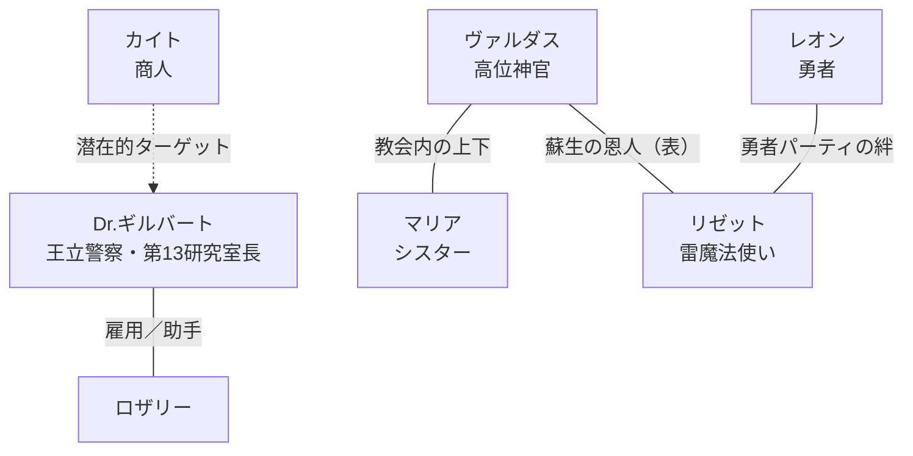
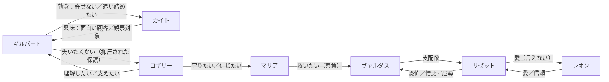

### 人物関係図（社会的関係性＝変化あり／内面的関係性＝変化なし）

このファイルは `キャラクタープロファイル.yaml` をベースに、事件によって変化する**社会的な関係**と、基本的に変わらない**内面的な関係（感情・欲求・執着）**を分けて整理したものです。

---

### 登場人物（主要）
- **Dr. ギルバート**：王立警察・特別高等部 第13研究室長（科学捜査官）
- **ロザリー**：ギルバートの助手／視点主
- **カイト**：知識商人（表）／死の商人（裏）
- **リゼット（Lisette）**：元・勇者パーティ雷魔法使い（真犯人）／不完全蘇生者
- **レオン（Leon）**：勇者（リゼットの幼馴染）
- **ヴァルダス**：高位神官（被害者）
- **マリア**：教会のシスター（第一発見者／重要参考人／疑われる）

※ロザリーとマリアの血縁は `キャラクタープロファイル.yaml` 内で明記が弱い一方、他資料で「姉のマリア」示唆が強いので、**人物関係としては“姉妹（推奨）”**で設計しています（不要なら「知人・共闘者」に差し替え可能）。

---

### 社会的関係性（変化あり）— 事件前→事件後

#### 事件前（表の関係）



#### 事件後（捜査・発覚後の表の関係）

```mermaid
graph TD
  subgraph 捜査側
    G[ギルバート] ---|相棒化（協働）| R[ロザリー]
  end

  subgraph 容疑構造（警察の見立て）
    P[王立警察] -->|容疑／拘束圧| M[マリア]
    P -->|協力要請／事情聴取| L[レオン]
  end

  subgraph 真相
    E[リゼット] -->|殺害／復讐| V[ヴァルダス]
    K[カイト] -->|知識・道具供給| E
    G -.追跡.-> K
  end

  R ---|（推奨）姉妹| M
  L ---|信頼崩壊／喪失| E
```

---

### 内面的関係性（変化なし）— “立場が変わっても動かない本音”



---

### 関係性一覧（社会＝変化／内面＝不変）

#### ギルバート ↔ ロザリー
- **社会（変化）**：雇用主↔助手 → 相棒／共同捜査 → “互いに欠かせない”ペア
- **内面（不変）**：ロザリーは「理解したい・支えたい」、ギルバートは「守りたいが距離を置きたい」

#### ギルバート ↔ カイト
- **社会（変化）**：不審な商人（影） → 追跡対象 → 宿敵（次回作へ）
- **内面（不変）**：ギルバート＝憎悪と執念／カイト＝興味と利用価値評価

#### リゼット ↔ レオン
- **社会（変化）**：勇者パーティの相棒 → 捜査協力者↔被疑者の関係に揺れる → 破局（喪失）
- **内面（不変）**：互いに愛情がある（リゼットは罪悪感で拒む／レオンは理由が分からず苦しむ）

#### リゼット ↔ ヴァルダス
- **社会（変化）**：恩人（蘇生者）↔被蘇生者（表） → 実態は支配／搾取 → 殺害で決着
- **内面（不変）**：リゼット＝恐怖・憎悪・屈辱／ヴァルダス＝支配欲

#### マリア ↔ ヴァルダス
- **社会（変化）**：教会内の上下（神官↔シスター） → 第一発見者→容疑者 → 無実（ギルバートによる救済）
- **内面（不変）**：マリア＝「救いたい」善意（だからこそ悲劇になる）

#### ロザリー ↔ マリア（推奨：姉妹）
- **社会（変化）**：姉妹（私的）→ 捜査で引き裂かれる（容疑者化）→ “救われる／傷が残る”
- **内面（不変）**：ロザリー＝「姉を守りたい」／マリア＝「誰かを救いたい」

---

### 使い方（執筆のメモ）
- **社会的関係**は「肩書き・容疑・立場」で揺らし、ミステリの推進力にする。
- **内面的関係**は揺らさず、「揺れる社会」とのギャップでエモを作る（例：愛しているのに拒む／善意なのに罪になる）。


